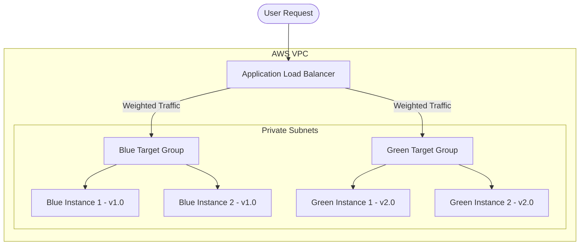

# AWS Blue-Green Deployment with Terraform

This project demonstrates how to implement a **Blue-Green Deployment** strategy on AWS using Terraform. It provisions a high-availability infrastructure with an Application Load Balancer (ALB) that dynamically distributes traffic between two distinct environments: **Blue** (active/running version 1.0) and **Green** (new/running version 2.0).

---

## 🏗️ Architecture Overview

The infrastructure deployed by this Terraform configuration consists of the following components:



- **VPC Module**: Creates a VPC (`10.0.0.0/16`) spanning 2 Availability Zones with:
  - 2 Public Subnets (for the Application Load Balancer).
  - 2 Private Subnets (for the EC2 instances, ensuring they are not directly exposed to the internet).
  - 1 NAT Gateway to allow private instances to access external resources (e.g., download Nginx during initialization).
- **Security Groups**:
  - `lb-sg`: Allows inbound HTTP (port 80) traffic from anywhere (`0.0.0.0/0`) to the load balancer.
  - `web-sg`: Restricts inbound HTTP (port 80) traffic to the EC2 instances to only originate from within the VPC (specifically routed through the ALB).
- **Application Load Balancer (ALB)**: Acts as the entry point and routes traffic to the target groups based on listener rules.
- **Blue Target Group & Instances**: Deploys Nginx servers serving an HTML page with the text `version 1.0 - #instance_id`.
- **Green Target Group & Instances**: Deploys Nginx servers serving an HTML page with the text `version 2.0 - #instance_id`.

---

## 🚦 Traffic Shifting Mechanism

Traffic distribution is managed dynamically via the ALB listener (`aws_lb_listener.app`) configuration. The routing weights are defined by a local lookup map based on the `traffic_distribution` variable.

### Supported Routing Profiles (`traffic_distribution`)

| Profile | Blue Weight (%) | Green Weight (%) | Description |
| :--- | :---: | :---: | :--- |
| `blue` | 100 | 0 | All traffic is routed to the Blue environment (default). |
| `blue-90` | 90 | 10 | Canary release: 10% of traffic goes to the Green environment. |
| `split` | 50 | 50 | Balanced test: 50% traffic to Blue, 50% traffic to Green. |
| `green-90` | 10 | 90 | Rollout phase: 90% traffic to Green, 10% to Blue. |
| `green` | 0 | 100 | Full migration: 100% traffic is routed to the Green environment. |

### Environment Flags
- `enable_blue_env` (boolean, default: `true`): Controls whether the Blue environment instances are created.
- `enable_green_env` (boolean, default: `true`): Controls whether the Green environment instances are created.

---

## 📁 Repository Structure

* **`main.tf`**: Contains the provider definitions, VPC configuration, Security Groups, Application Load Balancer, and the core routing logic for the ALB listener.
* **`blue.tf`**: Configures the Blue environment resources (EC2 instances, target group, and load balancer target attachment).
* **`green.tf`**: Configures the Green environment resources (EC2 instances, target group, and load balancer target attachment).
* **`variables.tf`**: Declares configurable inputs and the `traffic_dist_map` local lookup structure.
* **`outputs.tf`**: Exposes the load balancer DNS URL (`lb_dns_name`) so you can access the application easily.
* **`terraform.tf`**: Declares Terraform CLI version requirements (`~> 1.15.0`) and provider version constraints.
* **`init-script.sh`**: User data startup script that sets up password authentication, installs Nginx, and configures the default HTML web page with the deployment version.

---

## 🚀 Deployment Guide

### Prerequisites
1. Installed **Terraform** (matching `~> 1.15.0`).
2. **AWS CLI** installed and configured with appropriate permissions.
3. Set your target region in `terraform.tfvars` or pass it as a variable.

### 1. Initialize Terraform
Run the following command to download the required AWS and Random providers and VPC security group modules:
```bash
terraform init
```

### 2. Deploy Blue Environment (Default)
By default, the setup initializes with all traffic directed to the **Blue** environment.
```bash
terraform apply -auto-approve
```
After deployment, retrieve the DNS name from the output:
```bash
# Example Output:
# lb_dns_name = "main-app-some-pet-name-lb-123456789.us-west-2.elb.amazonaws.com"
```
You can access this URL in your web browser or query it using `curl`:
```bash
curl http://$(terraform output -raw lb_dns_name)
# Returns: "version 1.0 - #0!" or similar.
```

### 3. Canary Release / Incremental Traffic Shifting
To start routing 10% of your users to the new **Green** environment, apply with the `blue-90` distribution:
```bash
terraform apply -var="traffic_distribution=blue-90" -auto-approve
```

To route traffic equally between both environments (50/50 split):
```bash
terraform apply -var="traffic_distribution=split" -auto-approve
```
Test the distribution using a loop:
```bash
for i in {1..10}; do curl -s http://$(terraform output -raw lb_dns_name); echo ""; done
```
You should see a mix of `version 1.0` and `version 2.0` responses.

### 4. Complete Green Rollout
Route all traffic (100%) to the Green environment:
```bash
terraform apply -var="traffic_distribution=green" -auto-approve
```

### 5. Deprecating/Tearing Down the Blue Environment
Once you are confident in the Green deployment, you can safely spin down the Blue instances to save costs:
```bash
terraform apply -var="traffic_distribution=green" -var="enable_blue_env=false" -auto-approve
```

---

## 🧹 Cleanup

To destroy all provisioned infrastructure and avoid incurring AWS charges, run:
```bash
terraform destroy -auto-approve
```
